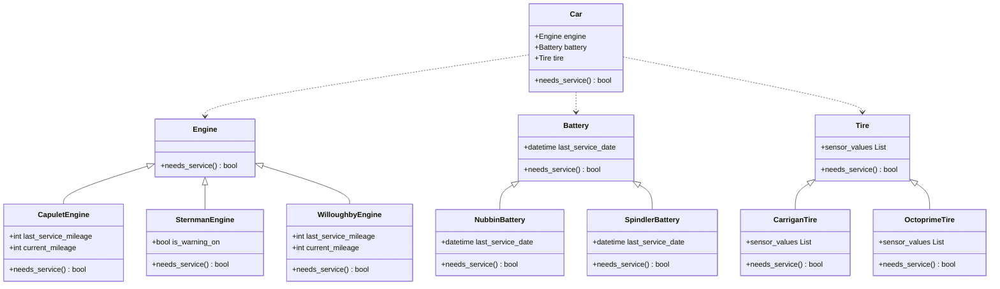

## Notes

- Engine and Battery classes are not implemented with a functioning `needs_service()` function (it will be an abstract method).
  - Specific engines and batteries, such as Spindler or Capulet, will be classes that inherit from their related parts class and implement its own `needs_service()` function
- The `needs_service()` function in a Car class exists to check all parts that are in the car at once, should that function be desirable
  - In order for this function to work optimally, however, the parts should be collected in some kind of array or dict. However, there are no current plans to implement this optimally.

## Requirements

The current service criteria are as follows:

- Engines
  - Capulet Engine - should be serviced once every 30,000 miles
  - Willoughby Engine - should be serviced once every 60,000 miles
  - Sternman Engine - should be serviced only when the warning indicator is on
- Batteries
  - Spindler Battery - should be serviced once every 2 years
  - Nubbin Battery - should be serviced once every 4 years

The current car models are as follows:

- Calliope
  - Capulet Engine
  - Spindler Battery
- Glissade
  - Willoughby Engine
  - Spindler Battery
- Palindrome
  - Sternman Engine
  - Spindler Battery
- Rorschach
  - Willoughby Engine
  - Nubbin Battery
- Thovex
  - Capulet Engine
  - Nubbin Battery
